# Slide source: Agent loops and safeguards

Use this file to build the deck. Each `## Slide` is one slide. Copy the Mermaid blocks into [mermaid.live](https://mermaid.live), Gamma, Notion, or VS Code preview, then screenshot / export.

**Talk in one line:** three setups, same model, same five tools — show how an agent loop works, then show why a schema on the request is not a safeguard.

| Setup | What it is | Port |
| :--- | :--- | :--- |
| **1 Naive** | Schema only. Unrestricted tool calling. | web `5173` · API `3001` |
| **2 Hardened** | Zod schema validation + risk-level HITL. | web `5174` · API `3002` |
| **3 MCP** | Same human gate, tools moved to an MCP server. | web `5175` · API `3003` |

Speaker honesty (do not skip): Setup 3 keeps the **risk-level pause**. It does **not** re-run Zod. Zod self-correction is the Setup 2 story. MCP is *where tools live*, not a smarter model.

Live demo file: `DEMO_SCRIPT.md`. Personal notes: `HOW_IT_WORKS.md`.

---

## Slide 1 — Title

**From schema to runtime: how an agent loop actually runs**

A 3-setup demo of local AI agents

1. Unrestricted tool calling  
2. Validation + risk gates  
3. Same gates, tools over MCP  

> *Same local model. Same five tools. Different runtime around the model.*

---

## Slide 2 — What this talk is (and is not)

**Is:** system design of an agent loop, and why safeguards change what the audience sees.

**Is not:** a new model, a chatbot UI contest, or “MCP makes the LLM smarter.”

The claim:

> A tools JSON schema in the API request is documentation for the model.  
> A safeguard is code that runs **after** the model answers and **before** the tool touches disk or shell.

---

## Slide 3 — Shared architecture

All three demos are full stacks on purpose (no shared packages). The browser never talks to the model.

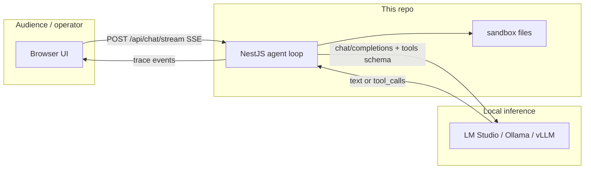

| Layer | Role |
| :--- | :--- |
| Left column | Chat |
| Right column | Execution trace (the loop, live) |
| Nest | Agent loop, SSE, (optional) Zod / HITL / MCP client |
| Local LLM | Next action: talk, or call a tool |

---

## Slide 4 — The agent loop (this is the whole product)

An **agent** here is not “a chat model.” It is a **loop**: model → tools → results → model, until it answers in text. Cap: **8 rounds**.

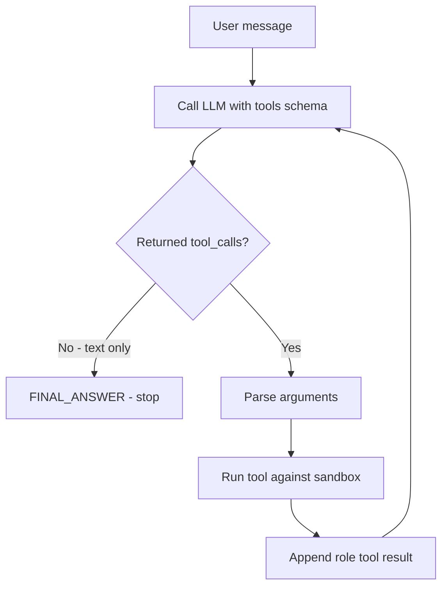

Say this out loud:

> Round: waiting on model → maybe a tool card → result → waiting on model again.  
> That is the loop. The three setups only change the box in the middle.

---

## Slide 5 — Same five tools (invariant)

If the tools differ, the comparison is unfair. Names stay the same even on Windows (`bash` still named `bash`; it runs PowerShell).

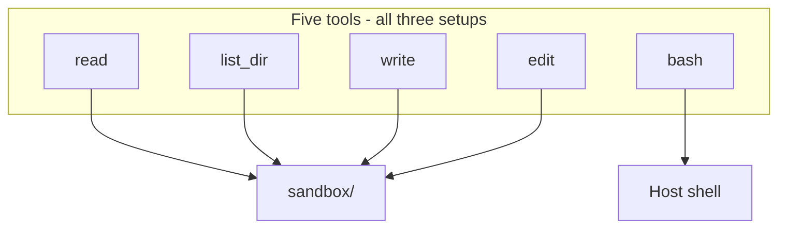

| Tool | Effect | Setup 2/3 risk |
| :--- | :--- | :--- |
| `read` | Read a file | Tier 1 — auto |
| `list_dir` | List files | Tier 1 — auto |
| `write` | Create / overwrite | Tier 2 — ask |
| `edit` | Search-replace | Tier 2 — ask |
| `bash` | Shell command | Tier 3 — ask, red |

Workspace is each demo’s `sandbox/` (`sample.txt`, `package.json`, `debug.log`).

---

## Slide 6 — Three setups, one picture

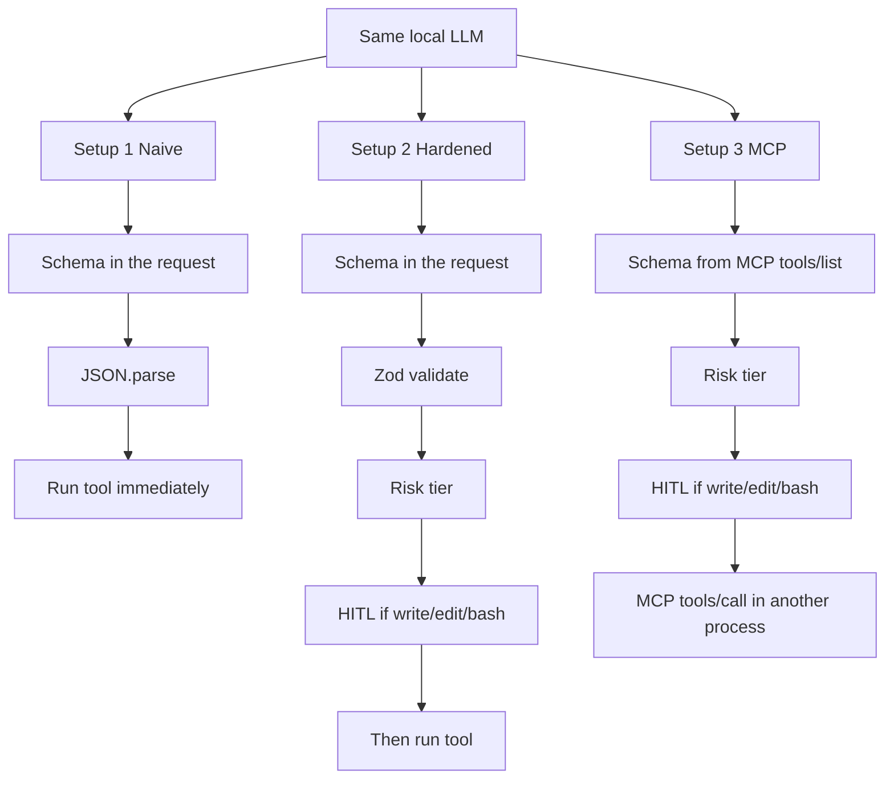

| | Setup 1 | Setup 2 | Setup 3 |
| :--- | :--- | :--- | :--- |
| Schema shown to the model | Yes | Yes | Yes (discovered) |
| Runtime schema check | No | **Zod** | No Zod |
| Human gate | No | **3-tier HITL** | **Same HITL** |
| Tool process | Inside Nest | Inside Nest | **MCP stdio child** |

---

## Slide 7 — Setup 1: schema is not a runtime

**Design:** send `tools` JSON to the model, `JSON.parse` whatever comes back, call the function. No Zod. No modal.

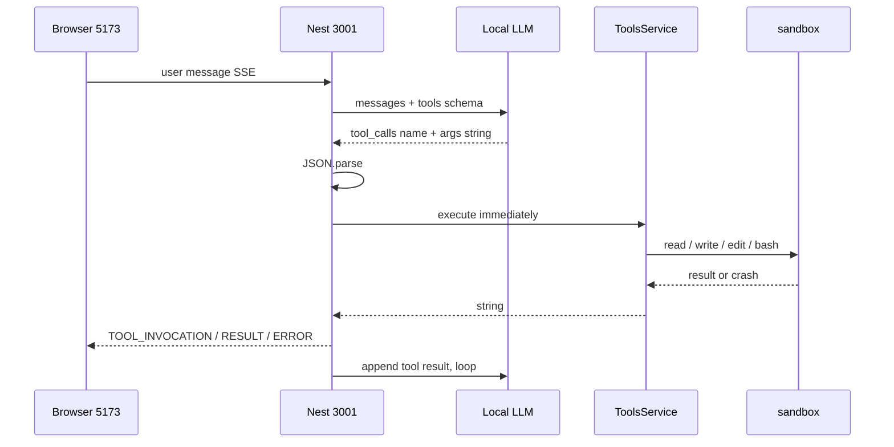

**What the audience should see:** `bash` delete `debug.log` runs with no one asked. Multi-step briefing writes `briefing.txt` with no pause.

**Line:** *We documented the tools. We did not enforce them.*

---

## Slide 8 — Setup 1: how tool calling fails (no brakes)

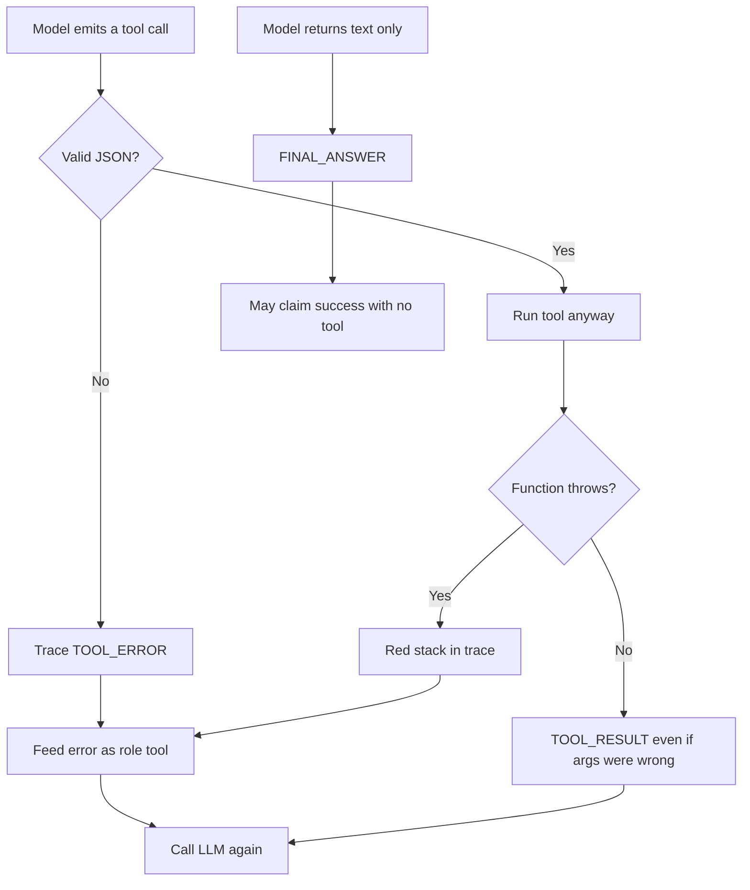

Failure modes to name:

1. **Never calls a tool** — treated as success. Chat can lie.  
2. **Bad / missing args** — still executed (empty `oldText` can corrupt `package.json`).  
3. **Throws** — error string goes back; loop retries.  
4. **`bash` exit 1** — returned as a *result*, not an exception.

---

## Slide 9 — Setup 2: put a runtime in the loop

Same loop. New boxes **between** “model asked” and “disk changed.”

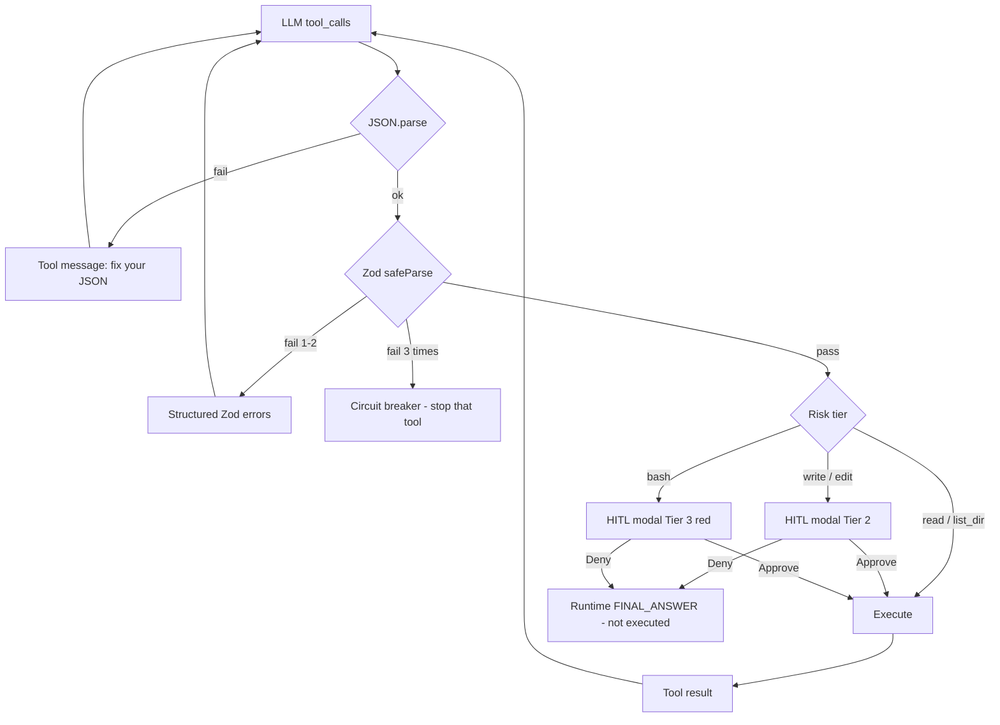

**Line:** *We did not change the model. We changed what is allowed to happen after it speaks.*

---

## Slide 10 — Safeguard A: Zod / schema validation

Schema in the **request** vs schema at **runtime**:

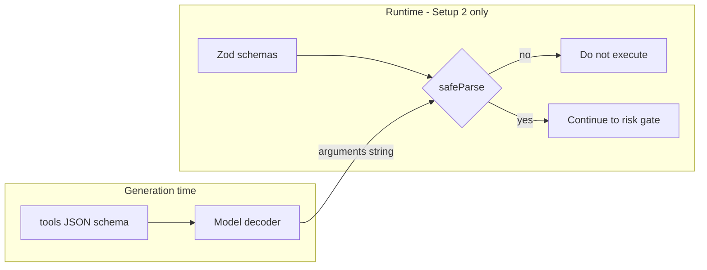

Zod catches (when the decoder does not already force valid JSON):

- missing / empty `oldText`
- `depth` as a string
- extra keys on `list_dir` (`.strict()`)
- unknown tool name

On fail: **do not run**. Feed field errors back. Model retries. After **2** retries, **circuit breaker**.

> Live-talk caveat: LM Studio / Ollama often constrain decoding, so Zod may not fire. The **HITL modal** is the reliable on-stage safeguard. Zod is still the right design.

---

## Slide 11 — Safeguard B: risk levels + HITL

**HITL** = human-in-the-loop. The loop **pauses**. Nothing mutates until Approve.

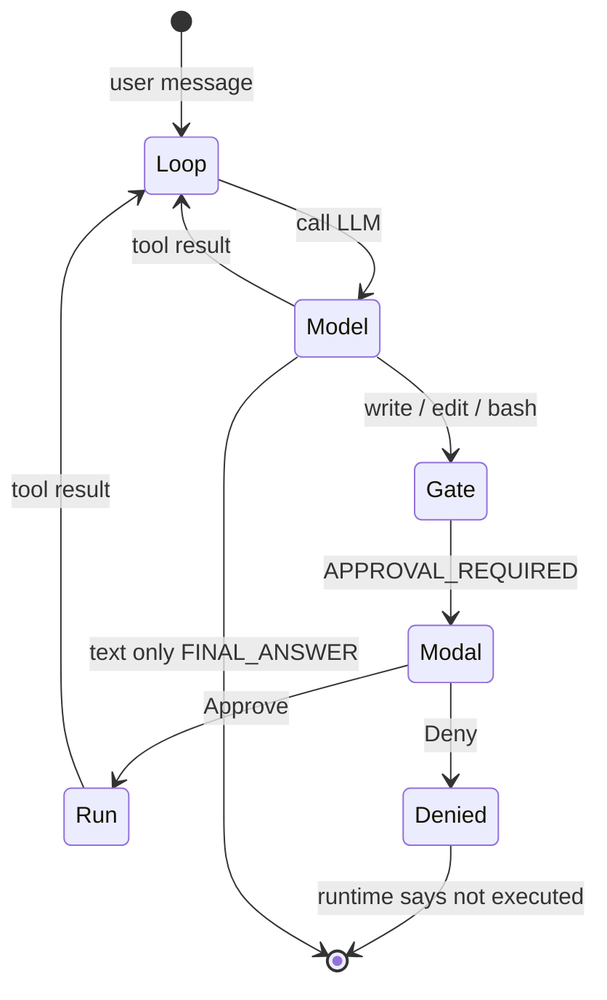

| Tier | Tools | UI |
| :--- | :--- | :--- |
| 1 Safe | `read`, `list_dir` | No modal |
| 2 Mutate | `write`, `edit` | Approval modal |
| 3 High risk | `bash` | Red modal + command preview |

Deny is **not** “ask the model to apologize.” Nest writes the final sentence so Qwen cannot claim the file was deleted.

---

## Slide 12 — Setup 2 sequence (validation then gate)

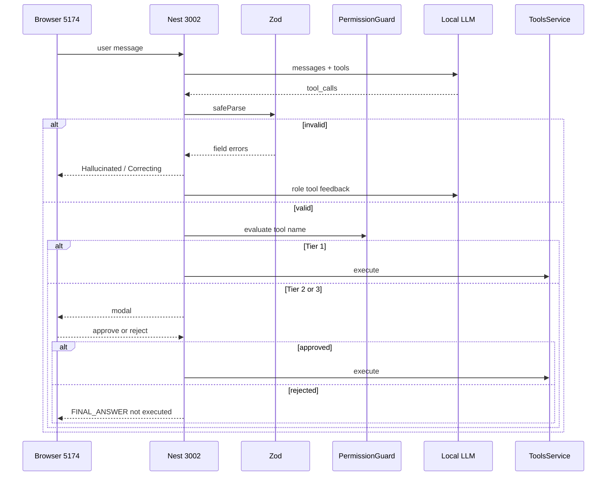

Demo card: **Loop: Multi-step briefing** — steps 1–3 (`list_dir`, `read`, `read`) auto; step 4 (`write`) pauses.

---

## Slide 13 — Setup 3: keep the gate, move the tools

Setup 2 tools still live **inside Nest**. Setup 3: Nest must not implement `read`/`write`/… The MCP server does.

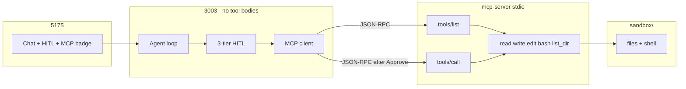

**Line:** *MCP is packaging. The model did not get new intelligence. The tools moved behind a protocol, and the gate still sits in front of the wire.*

---

## Slide 14 — MCP handshake (why the badge exists)

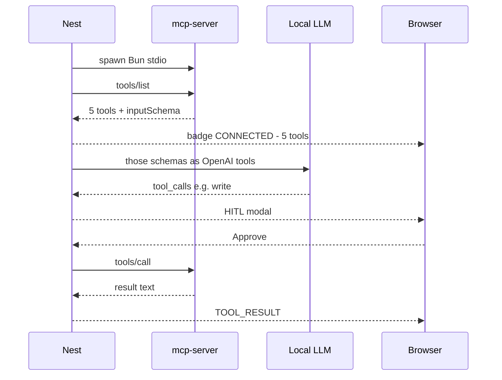

On stage: click the **MCP stdio** badge, then run the briefing or a write. Watch `tools/list` vs `tools/call`.

Setup 3 **does not** Zod-validate args. Bad JSON still errors and loops. The human gate is the safeguard you demo here.

---

## Slide 15 — Side-by-side: same task, three runtimes

Task: **Loop: Multi-step briefing**  
`list_dir` → `read sample.txt` → `read package.json` → `write briefing.txt` → final answer

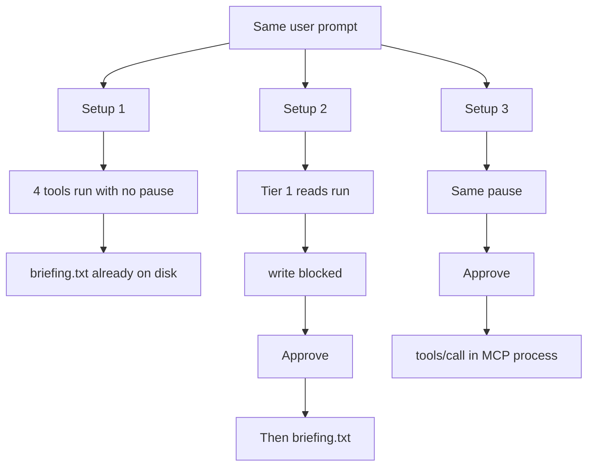

Second live pair: delete `debug.log`

| | Setup 1 | Setup 2 / 3 |
| :--- | :--- | :--- |
| `bash` delete | Immediate | Red modal |
| Deny | n/a | File still there; chat says it did not run |

---

## Slide 16 — Comparison (leave this up while you demo)

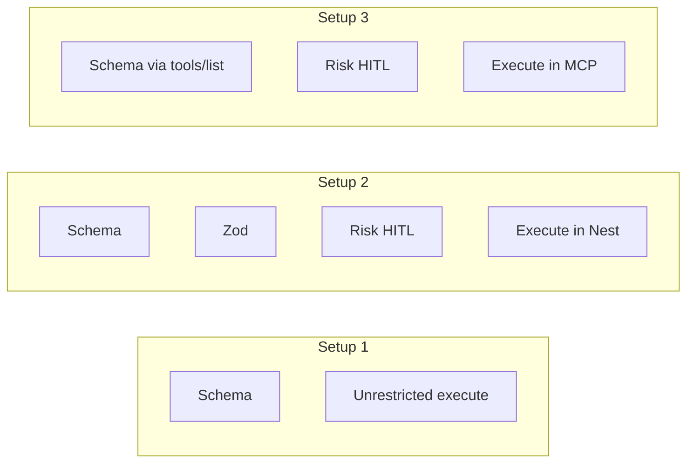

| | 1 Naive | 2 Hardened | 3 MCP |
| :--- | :--- | :--- | :--- |
| Agent loop | Yes | Yes | Yes |
| Schema for the model | Yes | Yes | Yes, discovered |
| Zod before execute | No | **Yes** + retry + breaker | No |
| HITL by risk | No | **Yes** | **Yes** |
| Tools in Nest | Yes | Yes | **No** |
| Isolation | None | Sandbox path guard | Sandbox + **separate process** |

---

## Slide 17 — System map (ports)

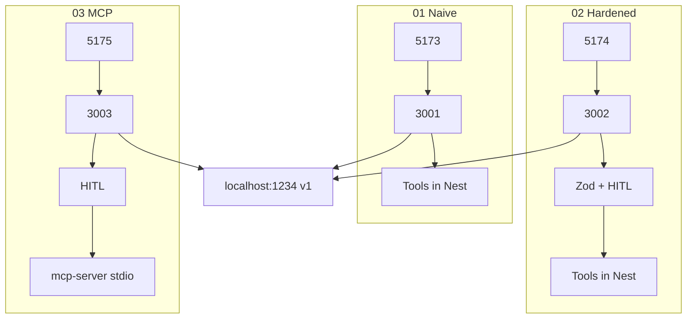

`bun run dev` from repo root starts all seven processes.

---

## Slide 18 — Takeaways

1. **An agent is a loop**, not a single completion.  
2. **A tools schema is not a safeguard.** Setup 1 already sends a schema.  
3. **Safeguards are runtime:** validate args (Zod), then pause by risk (HITL).  
4. **MCP does not replace those gates.** It moves tool *implementations* behind `tools/list` / `tools/call`.  
5. **Deny must be honest.** Do not let the model narrate a rejected delete.

Close:

> We did not train a better model. We put a runtime around the same one.

---

## Suggested slide order vs live clicks

| Slide | Click if you have time |
| :--- | :--- |
| 4 loop | — |
| 7 Setup 1 | `5173` Multi-step briefing, then delete `debug.log` |
| 9–12 Setup 2 | `5174` same briefing (Approve write), then delete and **Deny** |
| 13–14 Setup 3 | `5175` MCP badge, then briefing or write |

If the model is “too good” at schema, skip the omit-`oldText` card. The loop + modal still carry the talk.

---

## How to paste Mermaid into slides

1. Open this file in VS Code / GitHub preview to check diagrams.  
2. Copy a ` ```mermaid ` block into [mermaid.live](https://mermaid.live) → Actions → PNG/SVG.  
3. Dark theme: mermaid.live **Theme → dark**.  
4. Keep one diagram per slide; the tables under each slide are speaker notes, not extra charts.
